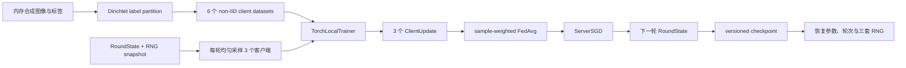

# E0.3 现实 clean FL 与精确恢复报告

日期：2026-07-11
分支：`codex/m0-baseline`

## 1. 本阶段要回答的问题

E0.1 证明了单轮编排与 FedAvg 数学正确，E0.2 证明了 IID、全参与、线性模型可以学习。E0.3 进一步回答：当数据变成 label-skew non-IID、每轮只有部分客户端参与、模型换成 CNN，并且训练可能中断时，clean FL 基线是否仍然可学习、可重放、可恢复？

本阶段仍只属于证据链 E0，不包含攻击、防御、best response 或 meta-update。

## 2. 模块与数据流



新增模块：

- `dirichlet_label_partition`：按标签分别采样 Dirichlet 客户端占比；显式接收 `RandomSource`，有限重试满足每客户端最小样本数。
- `ModelRegistry`：实验名称到无参 model factory 的显式映射；强制仍存活的模型实例不能被 factory 重用，不使用全局 mutable singleton。
- `TinyImageCNN`：用于 1×8×8 输入的小型 CNN；没有 BatchNorm，也没有 persistent buffer。
- `save_round_state` / `load_round_state`：使用 ZIP + JSON + NPY 的 version 1 checkpoint；不使用 pickle。

## 3. 单模块验证

### 3.1 non-IID 划分

验证内容：

- 相同 seed 得到完全相同的客户端索引；
- 所有样本恰好出现一次，无遗漏、无重叠；
- 每个客户端满足最小样本数；
- concentration=0.05 时，客户端平均标签熵显著低于 IID 的 `log(4)`；
- 空标签、非法客户端数、非法 concentration、非法最小样本数和不可满足约束均被拒绝。

### 3.2 模型注册与状态语义

验证内容：

- unknown name 与 duplicate registration 明确报错；
- 两次 `create` 必须返回不同的存活模型实例，否则拒绝共享实例；
- factory 自身的异常不会被错误包装为 unknown model；
- Tiny CNN 输入 `[N,1,8,8]`，输出 `[N,C]`；
- `named_buffers()` 为空，因此当前 `TorchParameterCodec` 的“仅训练参数”语义是完整且诚实的。

### 3.3 checkpoint

checkpoint 保存并恢复：

- `round_index`；
- 每个模型参数的值、shape 和 dtype；
- Python、NumPy、Torch CPU 三套显式 RNG 状态；
- JSON-compatible `component_states`；
- schema 名称和版本号。

加载阶段会把三套 RNG 状态恢复到临时 generator 做结构验证；恢复后，它们的下一次采样与保存前 snapshot 分支完全相同。未知版本、损坏 RNG payload 和非 JSON component state 会被拒绝。写入使用目标目录中的唯一临时文件，落盘后以 `os.replace` 发布；失败不会覆盖原 checkpoint，也会清理临时文件。

## 4. 纵向实验

实验配置：

- 120 个客户端训练图像，以及使用不同随机种子独立生成的 120 个 held-out 图像；均为内存中的 1×8×8 两类图像，不下载外部数据；
- 6 个客户端，Dirichlet concentration=0.3，每客户端至少 8 个样本；
- 每个 round 只采样 3 个客户端；
- Tiny CNN，本地 SGD，learning rate=0.15，local epoch=1，batch size=8；
- 共运行 10 个 FL rounds；
- 对照 A：不中断运行 10 轮；
- 对照 B：第 4 轮保存 checkpoint，重新构造 engine、trainer、registry、evaluator，加载到新 `RoundState`，并故意换成 seed=999 的新 `RandomSource` 对象后继续。

实际结果：

| 指标 | 结果 |
|---|---:|
| 初始 held-out loss | 0.6879523277 |
| 第 10 轮 held-out loss | 0.1733077884 |
| 第 10 轮 held-out accuracy | 1.0000000000 |
| 客户端平均 dominant-class fraction | 0.9492753623 |
| 每轮参与客户端数 | 3 / 6 |
| malicious updates | 0 |
| uninterrupted vs resumed 采样历史 | 完全相同 |
| uninterrupted vs resumed 逐轮指标 | 完全相同 |
| uninterrupted vs resumed 最终参数 | 逐元素完全相同 |

10 轮采样历史为：

```text
(3,0,4), (5,1,2), (3,0,4), (2,3,5), (1,5,2),
(3,2,0), (3,1,5), (5,0,2), (1,5,0), (4,2,0)
```

non-IID + partial participation 下，loss 不要求逐轮单调；本次第 1–3、5–6 轮的 accuracy 波动正是异质客户端局部偏置的可见表现。判断 clean learning 使用的是初始到最终的总体下降，以及最终独立 evaluator 结果，而不是伪造逐轮单调性。

## 5. 回归结果

使用 `/Users/antik/anaconda3/bin/python3`：

```text
python -m pytest tests/meta_stackelberg -q
73 passed

python -m pytest meta_sg/tests tests -q
393 passed

python -m pytest tests/meta_stackelberg/regression/test_dependency_boundaries.py -q
2 passed

git diff --check
clean
```

注：上面的最终数量包含自审和独立代码审查后新增的 label、model factory、RNG payload、原子写与真实 label-skew 边界测试；报告写入前已重新运行最终验证。

## 6. 结论与边界

E0.3 的预期证据已经成立：在可控的 label-skew non-IID、部分参与和 CNN 条件下，clean FL 能学习；round boundary checkpoint 能精确恢复训练轨迹，而不仅是“重新加载一组近似参数”。

当前 checkpoint 只覆盖训练参数，不覆盖模型 buffers。由于 BatchNorm running statistics 与整数 buffer 的客户端聚合语义不能默认等同于 FedAvg，本阶段明确使用无 buffer 模型，不宣称已支持任意 PyTorch `state_dict`。后续若实验需要 BatchNorm，必须先独立定义 server/client buffer 所有权、更新和聚合规则，再扩展状态类型与证据测试。

安全边界也必须说清楚：该格式通过禁止 pickle 避免加载时执行任意 Python 对象，但它面向本项目生成的可信本地 checkpoint，当前没有为敌对 ZIP 设置解压大小或压缩比上限，不能作为不可信文件上传格式使用。

下一阶段 E1 将在冻结 clean baseline 的前提下，引入攻击任务与 attacker，并分别验证攻击方向、强度和 oracle 指标，不能用本阶段结果替代攻击有效性证据。
